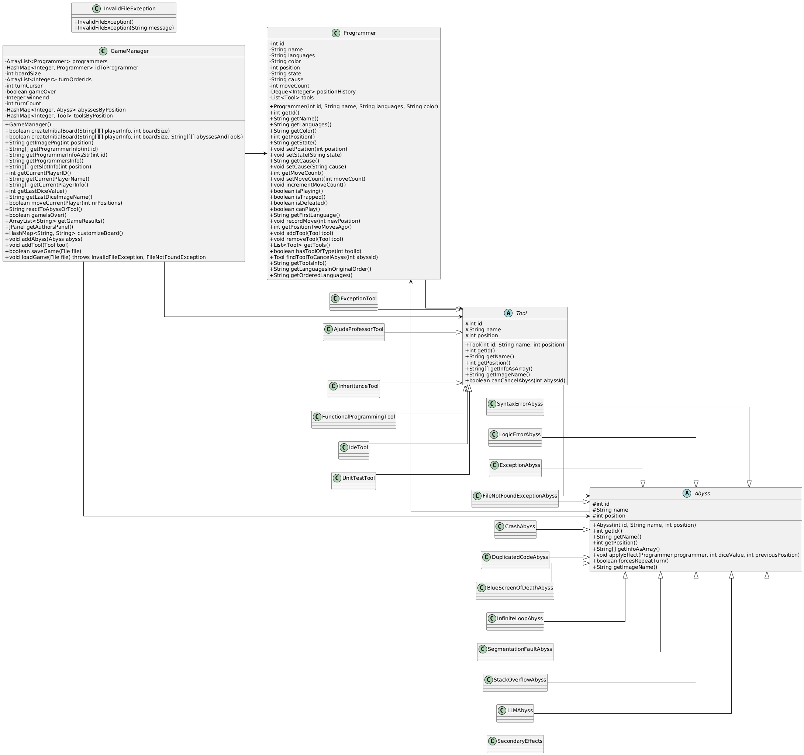

# The Great Programming Journey

## - Autor
- Gonçalo Alegria — a22408663

## - Enquadramento do Projeto
Este projeto foi desenvolvido no âmbito da unidade curricular **Linguagens de Programação II**, da **Universidade Lusófona de Humanidades e Tecnologias**.

O principal objetivo do trabalho é aplicar conceitos fundamentais de **Programação Orientada a Objetos (POO)**, nomeadamente:
- Encapsulamento
- Herança
- Polimorfismo
- Abstração

Foram implementados requisitos funcionais como:
- Gestão de turnos e movimento no tabuleiro
- Abismos com efeitos distintos sobre o jogador
- Ferramentas que interagem com abismos
- Eliminação/estado de jogadores
- Estrutura para gravação e carregamento de jogos

---

## - Modelo de Classes - UML

### Comentários 
O modelo foi estruturado à volta do **GameManager**, responsável por controlar o fluxo do jogo (ordem de turnos, movimentos, estado final e resultados). A informação e estado de cada jogador estão encapsulados em **Programmer**, mantendo os dados do jogador separados da lógica de controlo do jogo e reduzindo acoplamento.

Os elementos especiais do tabuleiro foram modelados com herança: **Abyss** e **Tool** são classes abstratas que concentram atributos e operações comuns (como identificação, nome e posição), enquanto as subclasses representam variações concretas com comportamentos específicos. Isto permite estender o jogo com novos abismos/ferramentas sem alterar o núcleo do controlo do jogo, tirando partido de polimorfismo.

A relação parte do **GameManager** para **Abyss/Tool** porque é o GameManager que os gere e consulta durante a execução (ex.: identificar o que existe numa posição e aplicar o respetivo efeito). O `id` não é repetido em cada subclass porque é herdado das classes abstratas; nas classes concretas apenas se atribui um valor ao mesmo `id` já existente.

---

## - Vídeo
- URL: (https://youtu.be/6haa-eV5nGU)
  No inicio do video disse componente prática mas queria dizer componente criativa.

---

## - Componente de Criatividade
A componente de criatividade implementada foi o **abismo `StackOverflowAbyss`**, inspirado na situação em que um programador fica “preso” a procurar soluções e acaba por perder progresso.

Quando um jogador cai neste abismo, o jogo calcula quantas **ferramentas** o programador tem no momento. Se tiver ferramentas, o jogador recua um número de casas **igual ao número de ferramentas**; se não tiver nenhuma, recua **1** casa. De seguida, o jogador **perde todas as ferramentas** (são removidas do inventário). A nova posição nunca pode ficar abaixo da **casa 1**: se o recuo ultrapassar o início do tabuleiro, o jogador é colocado na posição 1. Este abismo **não força repetição de turno**.
